# Part 1. Инструмент ipcalc
## Подними виртуальную машину (далее -- ws1)
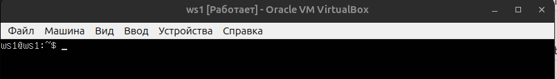
## 1.1. Сети и маски
### 1) Адрес сети 192.167.38.54/13

### 2)  Перевод маски 255.255.255.0 в префиксную и двоичную запись
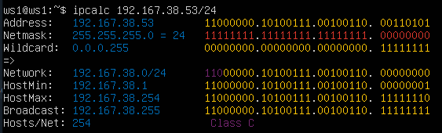
- Префиксная: /24
- Двоичная: 11111111.11111111.11111111.00000000
### /15 в обычную и двоичную
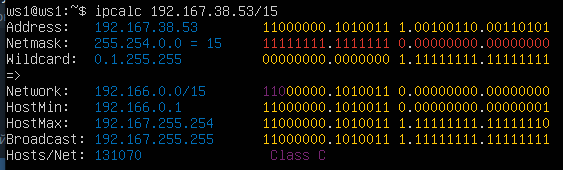
- Обычная: 255.254.0.0
- Двоичная: 11111111.11111110.00000000.00000000
### 11111111.11111111.11111111.11110000 в обычную и префиксную

- Обычная: 255.255.255.240
- Префиксная: /28
### 3) Минимальный и максимальный хост в сети 12.167.38.4 при масках:
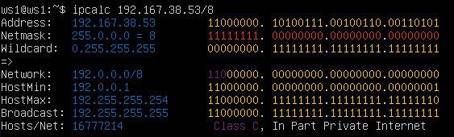
- /8 маска

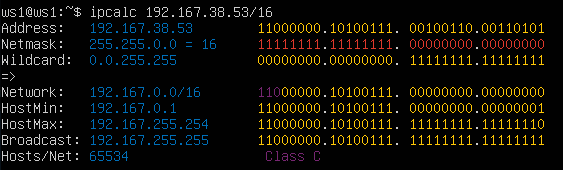
- /16 маска

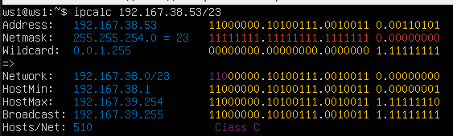
- /23 маска

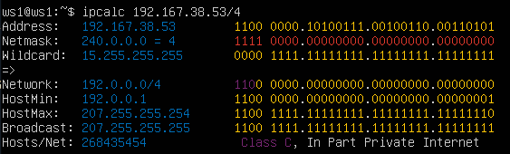
- /4 маска
## 1.2. localhost
- Можно обратиться к 127.0.0.2/24, 127.1.0.1/8
- Нельзя  194.34.23.100, 128.0.0.1
## 1.3. Диапазоны и сегменты сетей
### 1) Какие из перечисленных IP можно использовать в качестве публичного, а какие только в качестве частных: 10.0.0.45/8, 134.43.0.2/16, 192.168.4.2/16, 172.20.250.4/12, 172.0.2.1/12, 192.172.0.1/12, 172.68.0.2/12, 172.16.255.255/12, 10.10.10.10/8, 192.169.168.1/16

Частные:
1. 10.0.0.45/8
2. 192.168.4.2/16
3.  172.20.250.4/12
4.  172.16.255.255/12
5.  10.10.10.10/8

Публичные:
1. 134.43.0.2/16
2. 172.0.2.1/12
3. 192.172.0.1/12
4. 172.68.0.2/12
5.  192.169.168.1/16

### 2) какие из перечисленных IP адресов шлюза возможны у сети 10.10.0.0/18: 10.0.0.1, 10.10.0.2, 10.10.10.10, 10.10.100.1, 10.10.1.255

1. 10.10.0.2
2. 10.10.10.10
3.  10.10.1.255
# Part 2. Статическая маршрутизация между двумя машинами

## Подними две виртуальные машины (далее -- ws1 и ws2).
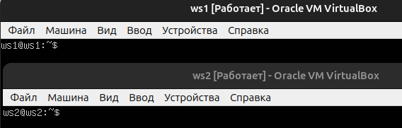
## С помощью команды ip a посмотри существующие сетевые интерфейсы.
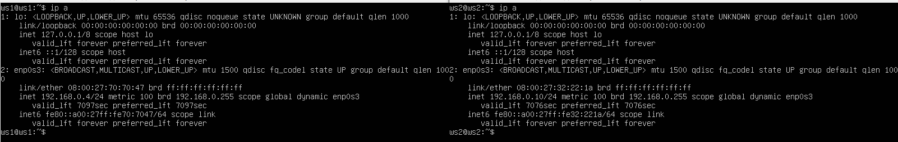
## Опиши сетевой интерфейс, соответствующий внутренней сети, на обеих машинах и задай следующие адреса и маски: ws1 — 192.168.100.10, маска /16, ws2 — 172.24.116.8, маска /12.
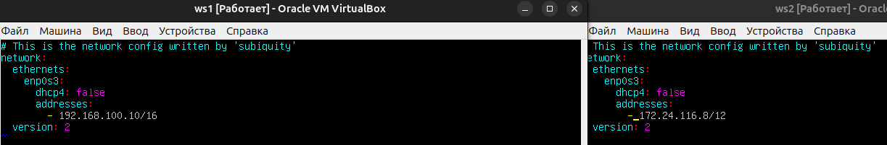
## Выполни команду netplan apply для перезапуска сервиса сети.
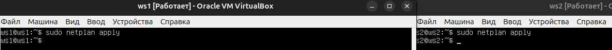
## 2.1. Добавление статического маршрута вручную
### Добавь статический маршрут от одной машины до другой и обратно при помощи команды вида ip r add. Пропингуй соединение между машинами.
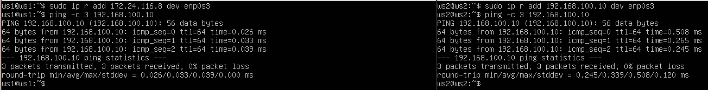
## 2.2. Добавление статического маршрута с сохранением Перезапусти машины.
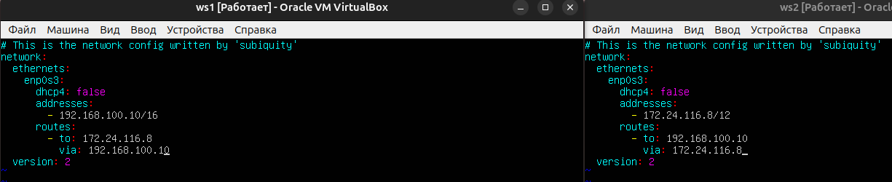
### Пропингуй соединение между машинами.
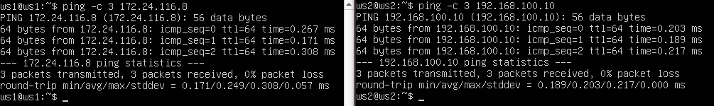
# Part 3. Утилита iperf3
## 3.1. Скорость соединения
### Переведи и запиши в отчёт: 8 Mbps в MB/s, 100 MB/s в Kbps, 1 Gbps в Mbps.
1. 8 Mbps = 1 MB/s
2. 100 MB/s = 819200 Kbps
3. 1 Gbps = 1024 Mbps
### 3.2. Утилита iperf3 Измерь скорость соединения между ws1 и ws2.
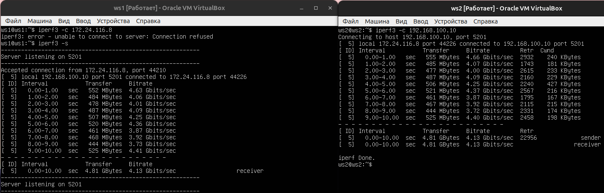
# Part 4. Сетевой экран
### 4.1. Утилита iptables   Создай файл /etc/firewall.sh, имитирующий файрвол, на ws1 и ws2:

- Правила выполняться сверху-вниз, если правило запрета находиться выше оно срабатывает, а правило разрешения находящиеся ниже нет
## 4.2. Утилита nmap
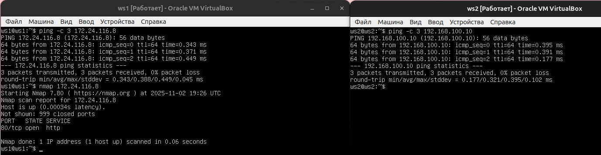
# Part 5. Статическая маршрутизация сети
## Настрой конфигурации машин в etc/netplan/00-installer-config.yaml согласно сети на рисунке.

ws11

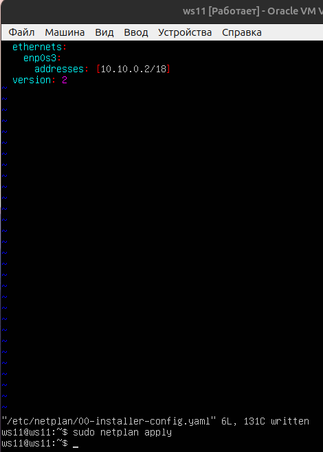

ws21

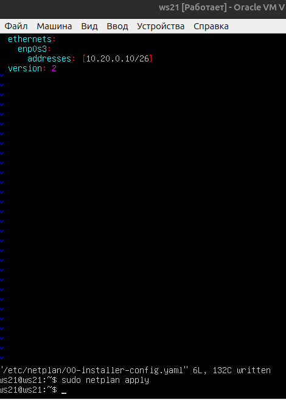

ws22

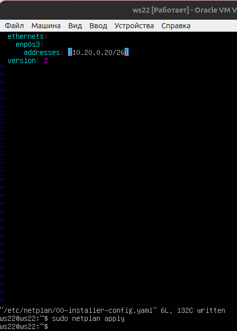

r1

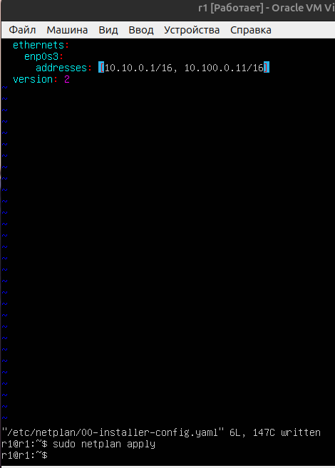

r2

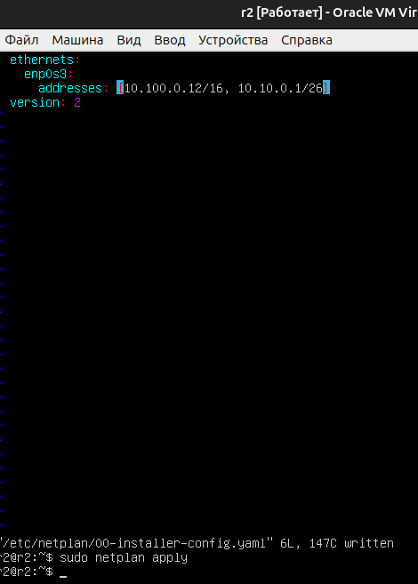
## Перезапусти сервис сети. Если ошибок нет, командой ip -4 a проверь, что адрес машины задан верно. Также пропингуй ws22 с ws21. Аналогично пропингуй r1 с ws11.
r1_r2

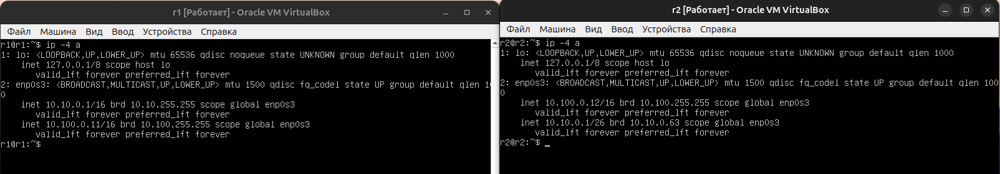

ws22 , ws21 , ws 11

Пропингуем ws22 с ws21

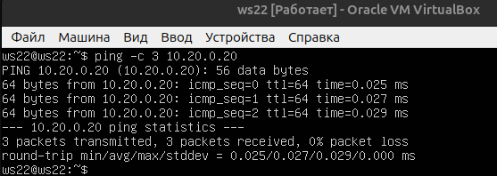

Пропингуем r1 с ws11

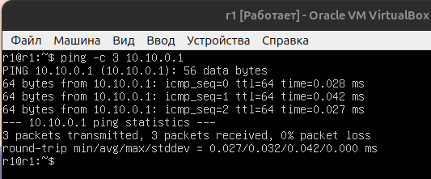
## 5.2. Включение переадресации IP-адресов
### Для включения переадресации IP выполни команду на роутерах:
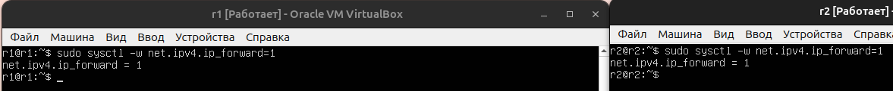
## Открой файл /etc/sysctl.conf и добавь в него следующую строку: net.ipv4.ip_forward = 1

## 5.3. Установка маршрута по умолчанию
## Настрой маршрут по умолчанию (шлюз) для рабочих станций.
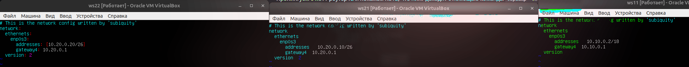
## Вызови ip r и покажи, что добавился маршрут в таблицу маршрутизации.

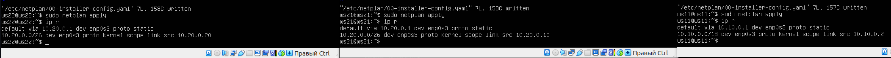
## Пропингуй с ws11 роутер r2 и покажи на r2, что пинг доходит. Для этого используй команду:
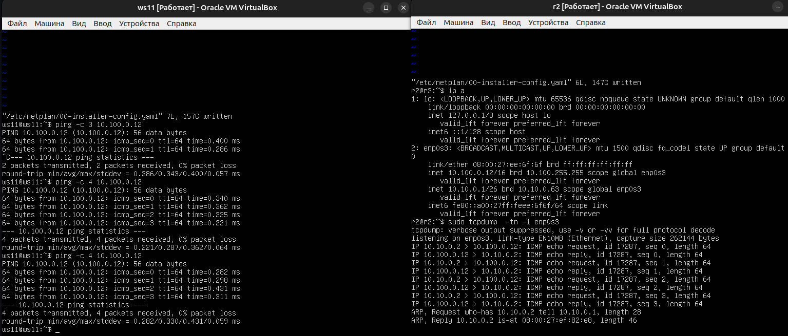
## 5.4. Добавление статических маршрутов
## Добавь в роутеры r1 и r2 статические маршруты в файле конфигураций
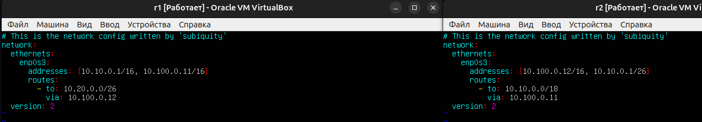
## Вызови ip r и покажи таблицы с маршрутами на обоих роутерах.
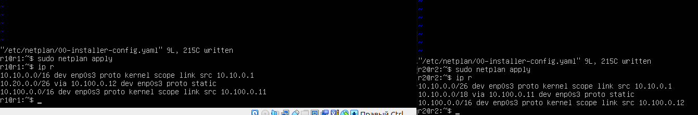
## Запусти команды на ws11 ip r list 10.10.0.0/[маска сети] и ip r list 0.0.0.0/0
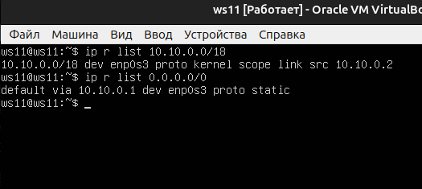
- В отчёте объясни, почему для адреса 10.10.0.0/[маска сети] был выбран маршрут, отличный от 0.0.0.0/0, хотя он попадает под маршрут по умолчанию.
- Потому что под 0.0.0.0  попадают все адреса

## 5.5. Построение списка маршрутизаторов
## Запусти на r1 команду дампа: tcpdump -tnv -i eth0(у нас epn0s3)
## При помощи утилиты traceroute построй список маршрутизаторов на пути от ws11 до ws21.
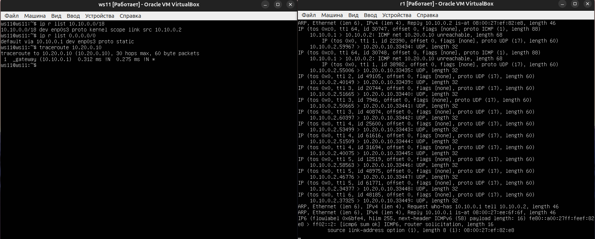
## В отчёте, опираясь на вывод, полученный из дампа на r1, объясни принцип работы построения пути при помощи traceroute.
- Traceroute использует поле TTL (Time To Live) в IP-пакетах для определения пути до целевого узла. traceroute помогает находить проблемы маршрутизации, использует поле TTL (Time To Live, TTL ≠ время в секундах!) в IP-пакетах для определения пути до целевого узла,первый маршрутизатор уменьшает TTL до 0, отправляет обратно ICMP Time Exceeded , узнает IP первого прыжка, в итоге  предотвращает бесконечные сетевые петли и ограничивает распространение пакетов. tcpdump - это консольный анализатор сетевых пакетов, который перехватывает и отображает сетевой трафик в реальном времени, перехватывает пакеты с сетевого интерфейса, сохраняет дампы в файлы для последующего анализа
## 5.6. Использование протокола ICMP при маршрутизации
### Запусти на r1 перехват сетевого трафика, проходящего через eth0 с помощью команды: tcpdump -n -i eth0 icmp Пропингуй с ws11 несуществующий IP (например, 10.30.0.111) с помощью команды:
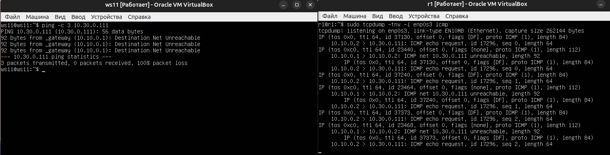

# Part 6. Динамическая настройка IP с помощью DHCP
## Для r2 настрой в файле /etc/dhcp/dhcpd.conf конфигурацию службы DHCP: 1) Укажи адрес маршрутизатора по умолчанию, DNS-сервер и адрес внутренней сети. Пример файла для r2:

subnet 10.100.0.0 netmask 255.255.0.0 {}

subnet 10.20.0.0 netmask 255.255.255.192
{
    range 10.20.0.2 10.20.0.50;
    option routers 10.20.0.1;
    option domain-name-servers 10.20.0.1;
}

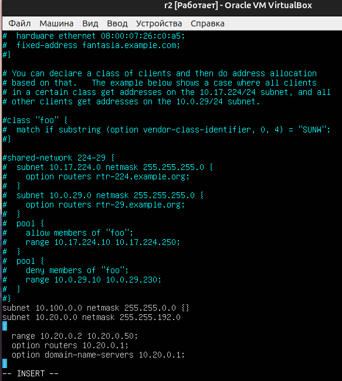

## 2) В файле resolv.conf пропиши nameserver 8.8.8.8.
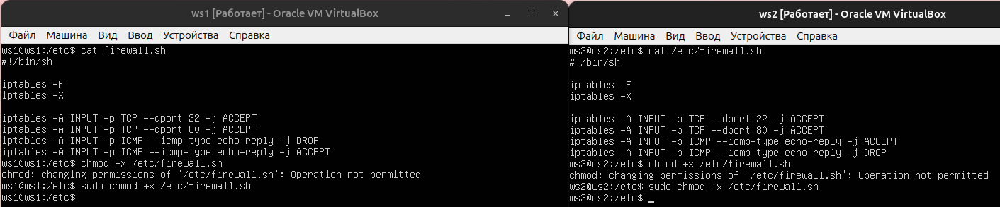

## Укажи MAC-адрес у ws11, для этого в etc/netplan/00-installer-config.yaml надо добавить строки: macaddress: 10:10:10:10:10:BA, dhcp4: true.

## Для r1 настрой аналогично r2, но сделай выдачу адресов с жесткой привязкой к MAC-адресу (ws11). Проведи аналогичные тесты.
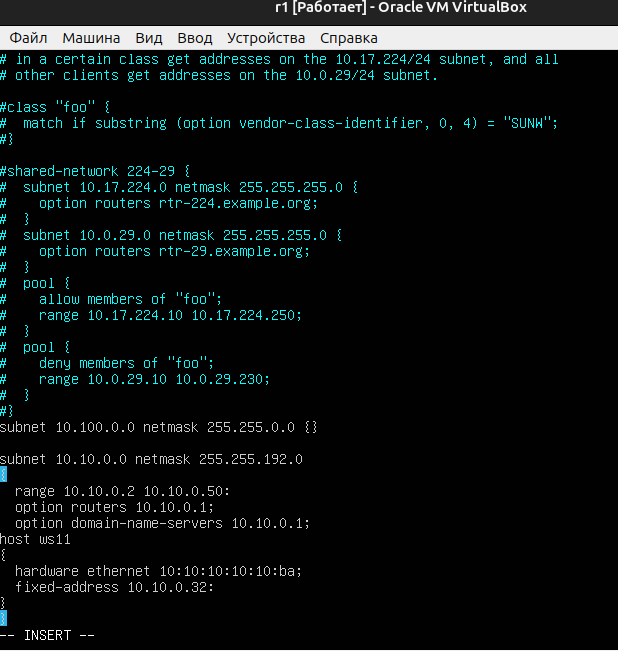

- dns

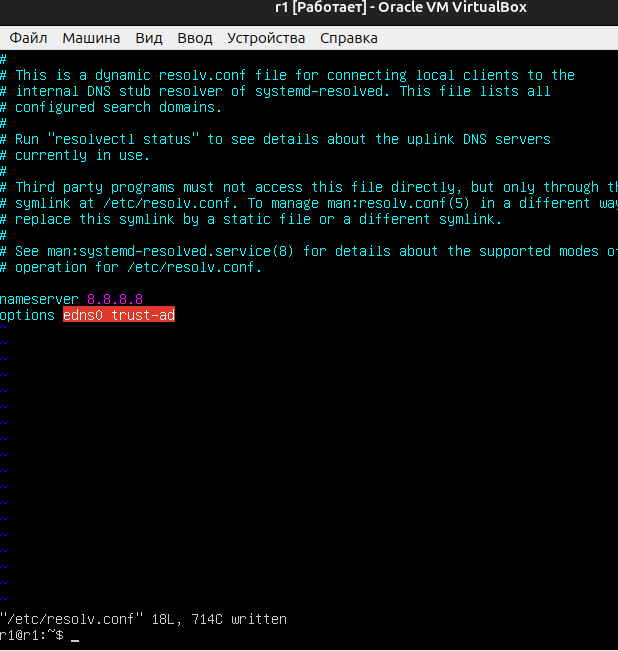

## Запроси с ws21 обновление IP-адреса.
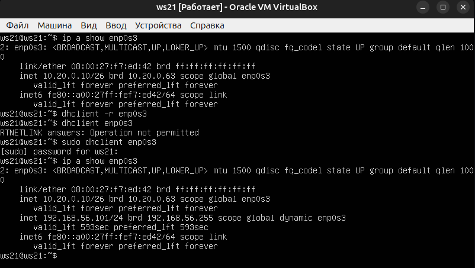

- В отчёте опиши, какими опциями DHCP сервера пользовался в данном пункте.
- Команда sudo dhclient -r enp0s3 освобождает текущий адрес интерфейса enp0s3. Команда sudo dhclient enp0s3 задает новый адрес указанному интерфейсу.

# Part 7. NAT

## В файле /etc/apache2/ports.conf на ws22 и r1 измени строку Listen 80 на Listen 0.0.0.0:80, то есть сделай сервер Apache2 общедоступным.
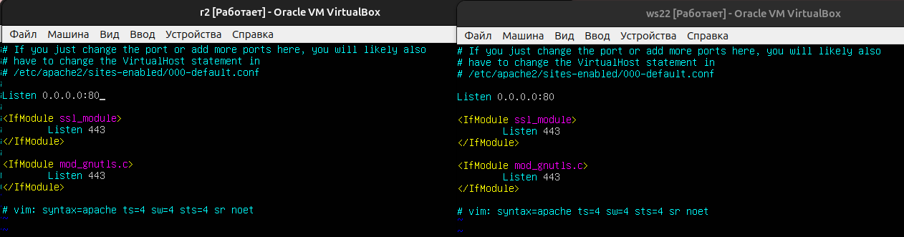
## Запусти веб-сервер Apache командой service apache2 start на ws22 и r1.
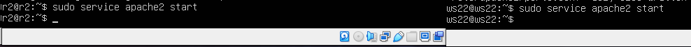

## Добавь в фаервол, созданный по аналогии с фаерволом из Части 4, на r2 следующие правила:
## 1) Удаление правил в таблице filter — iptables -F;
## 2) Удаление правил в таблице «NAT» — iptables -F -t nat;
## 3) Отбрасывать все маршрутизируемые пакеты — iptables --policy FORWARD DROP.
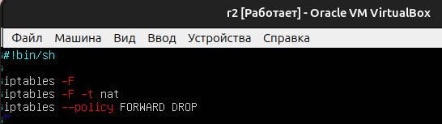
## Запусти файл также, как в Части 4.
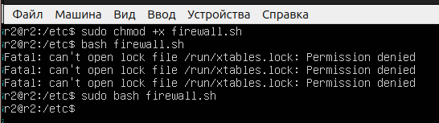

## Проверь соединение между ws22 и r1 командой ping.
## При запуске файла с этими правилами, ws22 не должна «пинговаться» с r1.
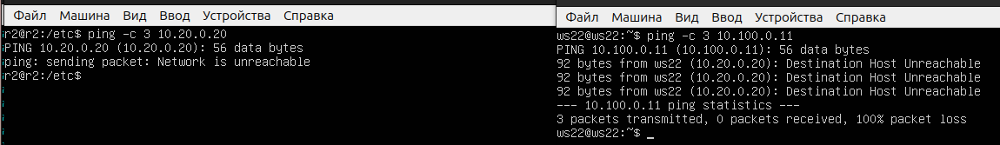

## Добавь в файл ещё одно правило:
## 4) Разрешить маршрутизацию всех пакетов протокола ICMP.

## Запусти файл также, как в Части 4.
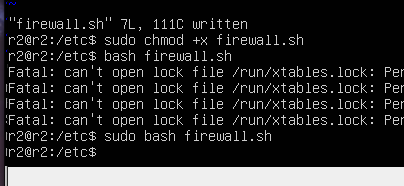
## Проверь соединение между ws22 и r1 командой ping.
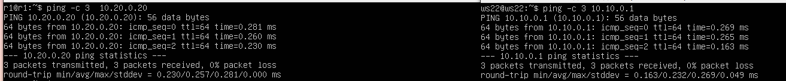

## 5) Включи SNAT, а именно маскирование всех локальных IPиз локальной сети, находящейся за r2 (по обозначениям из Части 5 — сеть 10.20.0.0).
## 6) Включи DNAT на 8080 порт машины r2 и добавить к веб-серверу Apache, запущенному на ws22, доступ извне сети.
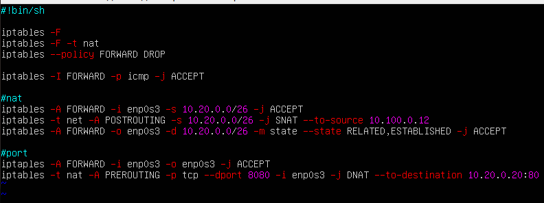

## Проверь соединение по TCP для SNAT: для этого с ws22 подключиться к серверу Apache на r1
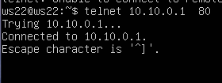

## Проверь соединение по TCP для DNAT: для этого с r1 подключиться к серверу Apache на ws22 командой telnet
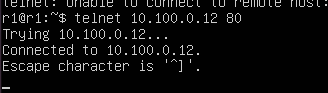
